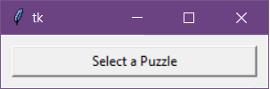
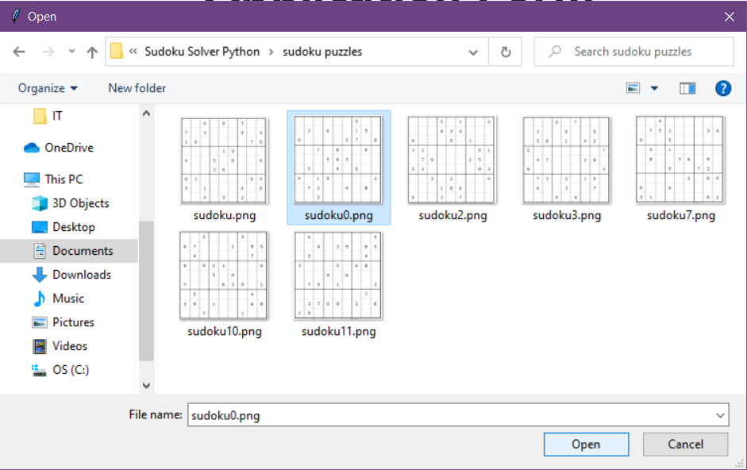
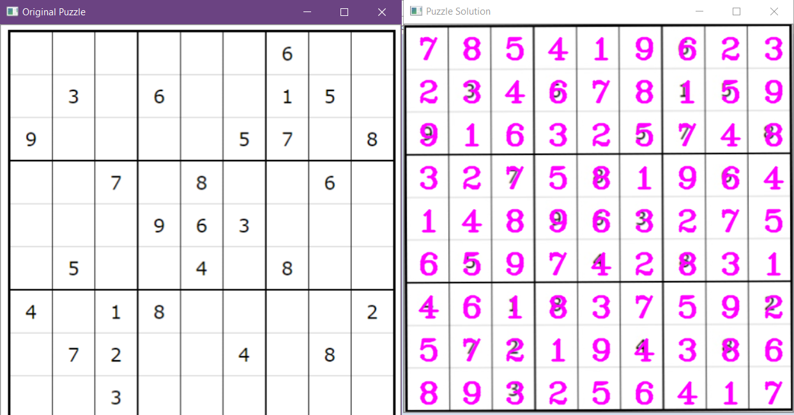

#Sudoku-Solver-Python
This is an application which takes images of sudoku and solves them.

Numbers are detected using neural network written from scratch. 

### Choosing Puzzle

### Solved Puzzle

